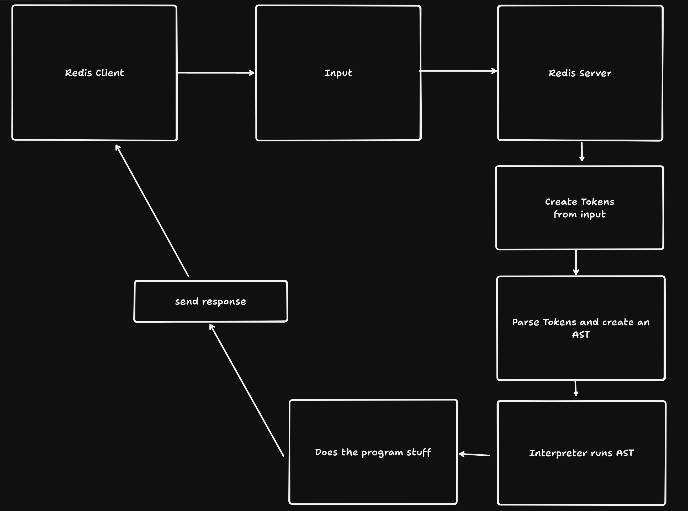
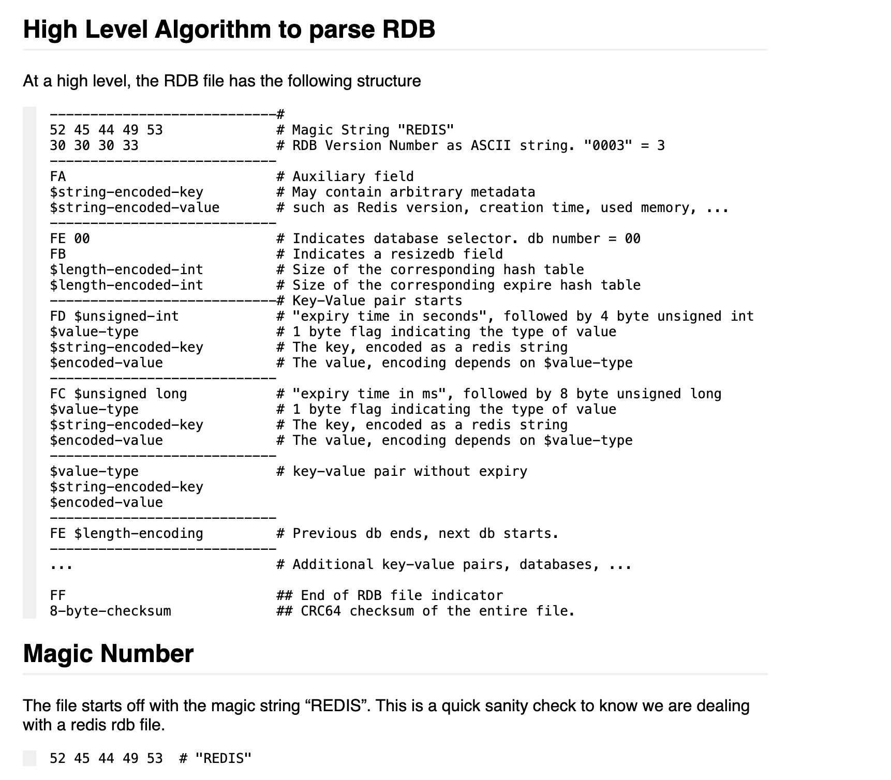
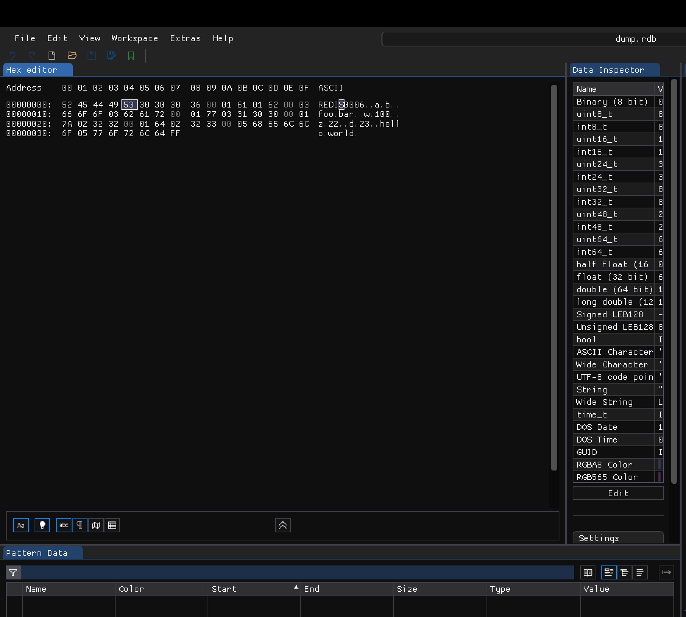

# Recreating Redis

---

## Agenda

1. What is Redis?
2. Recreating Redis
    - Tokenizer
    - interpreter / abstract syntax trees
    - reading RDB files
3. code usages in studio
4. redis introspection

---

## What is Redis?

<iframe width="560" height="315" src="https://www.youtube.com/embed/G1rOthIU-uo" frameborder="0" allowfullscreen></iframe>

---

## Recreating Redis

There's a lot more that goes into recreating redis - but will talk about the following

    - Tokenizer
    - abstract syntax trees
    - interpreter
    - reading RDB files

---

## Tokenizer

Key Functions of a Tokenizer in Programming Languages:

1.	Reading Input: The tokenizer reads the source code character by character.
2.	Generating Tokens: It groups sequences of characters into tokens based on predefined rules. For example, it may recognize sequences of letters as identifiers or keywords, sequences of digits as numbers, etc.
3.	Error Handling: It can detect and report errors related to invalid tokens or unrecognized character sequences.

---

Example of tokens

```ts
function add(a: number, b: number) {
    return a + b
}
```

```ts
[
    { "type": "keyword", "value": "function" },
    { "type": "identifier", "value": "add" },
    { "type": "punctuation", "value": "(" },
    { "type": "identifier", "value": "a" },
    { "type": "punctuation", "value": ":" },
    { "type": "keyword", "value": "number" },
    { "type": "punctuation", "value": "," },
    // ...
]
```

---

RESP Protocol

The Redis Serialization Protocol (RESP) is a simple, efficient, and human-readable protocol used by Redis to communicate between the Redis server and clients. 

RESP is designed to handle various data types and is optimized for parsing by computers.

RESP uses a prefix-based system to identify the type of data being transmitted.

---

Bulk Strings:

▪	Prefix: $
▪	Format: $<length>\r\n<string>\r\n
▪	If the string is null, it is represented as $-1\r\n.
▪	Example: $6\r\nfoobar\r\n

---

Arrays:

▪	Prefix: *
▪	Format: *<number of elements>\r\n<element 1><element 2>...
▪	If an array is null, it is represented as *-1\r\n.
▪	Example: *2\r\n$3\r\nfoo\r\n$3\r\nbar\r\n

---

REDIS

`ECHO hey`

`'*2\r\n$4\r\nECHO\r\n$3\r\nhey\r\n'`

---

Breakdown

`'*2\r\n$4\r\nECHO\r\n$3\r\nhey\r\n'`

1.	`*2\r\n`:
▪	`*`: Indicates that this is an array.
▪	`2`: Specifies that there are two elements in the array.
▪	`\r\n`: Carriage return and line feed, marking the end of this line.

---

`'*2\r\n$4\r\nECHO\r\n$3\r\nhey\r\n'`

2.	`$4\r\n`:
▪	`$`: Indicates that the next element is a bulk string.
▪	`4`: Specifies the length of the bulk string, which is 4 characters.
▪	`\r\n`: Marks the end of this length specification line.
▪	`ECHO\r\n`: The actual bulk string data, which is the command "ECHO". It is 4 characters long, matching the length specified.

---

`'*2\r\n$4\r\nECHO\r\n$3\r\nhey\r\n'`

3.	`$3\r\n`:
▪	`$`: Indicates another bulk string follows.
▪	`3`: Specifies the length of this bulk string, which is 3 characters.
▪	`\r\n`: Ends the length specification.
▪	`hey\r\n`: The actual bulk string data, which is the string "hey". It is 3 characters long, as specified.

---

Let's see how this could be converted into tokens!

```ts
export type Token = {
  type:
    | 'Number'
    | 'BulkString'
    | 'CRLF'
    | 'ArrayMarker'
    | 'BulkMarker'
    | 'Quote'
  value: string
}

const tokens: Token[] = [
  { type: 'ArrayMarker', value: '*' },
  { type: 'Number', value: '2' },
  { type: 'CRLF', value: '\r\n' },
  { type: 'BulkMarker', value: '$' },
  { type: 'Number', value: '4' },
  { type: 'CRLF', value: '\r\n' },
  { type: 'BulkString', value: 'ECHO' },
  { type: 'CRLF', value: '\r\n' },
  { type: 'BulkMarker', value: '$' },
  { type: 'Number', value: '3' },
  { type: 'CRLF', value: '\r\n' },
  { type: 'BulkString', value: 'hey' },
  { type: 'CRLF', value: '\r\n' }
];
```

---

Reduced tokenizer

In my example, I do an array of bulk strings

```ts
public tokenize(input: string): Token[] {
    const tokens: Token[] = []
    let i = 0
    while (i < input.length) {
      const char = input[i]
      if (char === '*' && this.isStartOfLine(input, i)) {
        // Only treat * as ArrayMarker if it's at the start of a line
        tokens.push({ type: 'ArrayMarker', value: char })
        i++
      } else if (char === '$') {
        tokens.push({ type: 'BulkMarker', value: char })
        i++
      } else if (char === '\r' && input[i + 1] === '\n') {
        tokens.push({ type: 'CRLF', value: '\r\n' })
        i += 2
      } else {
        // Handle bulk string content
        let value = ''
        while (i < input.length && input[i] !== '\r') {
          value += input[i]
          i++
        }
        if (value) {
          tokens.push({ type: 'BulkString', value })
        }
      }
    }
    return tokens
  }
```

---

```ts
[
  { type: 'ArrayMarker', value: '*' },
  { type: 'BulkString', value: '2' },
  { type: 'CRLF', value: '\r\n' },
  { type: 'BulkMarker', value: '$' },
  { type: 'BulkString', value: '4' },
  { type: 'CRLF', value: '\r\n' },
  { type: 'BulkString', value: 'ECHO' },
  { type: 'CRLF', value: '\r\n' },
  { type: 'BulkMarker', value: '$' },
  { type: 'BulkString', value: '3' },
  { type: 'CRLF', value: '\r\n' },
  { type: 'BulkString', value: 'hey' },
  { type: 'CRLF', value: '\r\n' }
]
```

---

## Interpreter / Parsers / Abstract Syntax Trees

---



---

`npm run example` 

---

Let's look at `executeCommand`

---

## Reading RDB files

An RDB file in Redis is a binary file that represents a snapshot of the in-memory data at a particular point in time. RDB stands for "Redis Database" file, and it's used for persistence in Redis to save the dataset to disk. 

Redis stores the binary in hexidecimal form

---

## Anatomy of an rdb file

---

Source:

https://rdb.fnordig.de/file_format.html



---

Hex Demo



---

Taking a peek

rdbReader

rdbReader.spec.ts

---

Studio Usages

